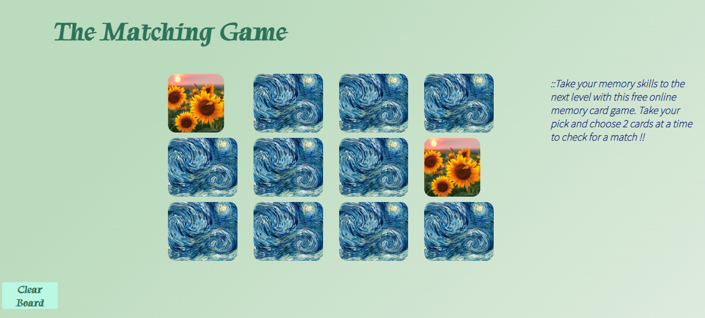

# ♠️ Week08 Bootcamp2019a Project: Matching Card Game
 
### Goal: Make a 10 card memory game - users must be able to select two cards and check if they are a match. If they are a match, they stay flipped. If not, they flip back over. Game is done when all cards are matched and flipped over. Example: http://www.fruit-burst.co.uk/fun-and-games/pairs-game
 
Build an application that allows users to play an interactive matching game by choosing 2 cards at a time to check for a match
**Link to project: https://ddmemorygame.netlify.app//
 

 
## How It's Made:
 
**Tech used:** HTML, CSS, JavaScript
 
 
I utilized my skills in javaScript, HTML and CSS to make this interactive application using arrays to manipulate the DOM using for loops and functions to check for a match. As well as check for a user's click using event listener.
## Lessons Learned:
I learned how to append an arrays information to a new empty array to send that data back to the DOM.
